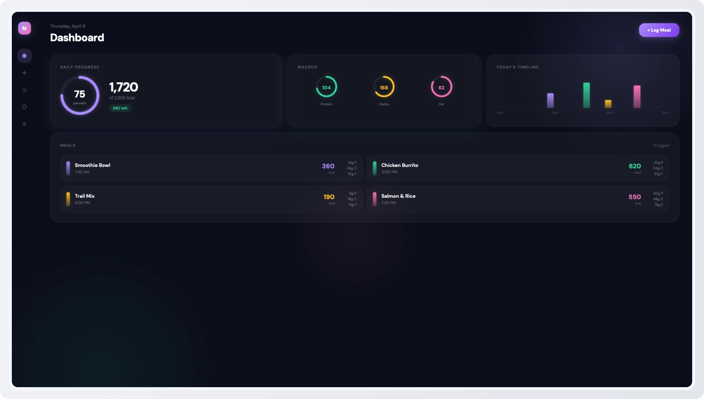
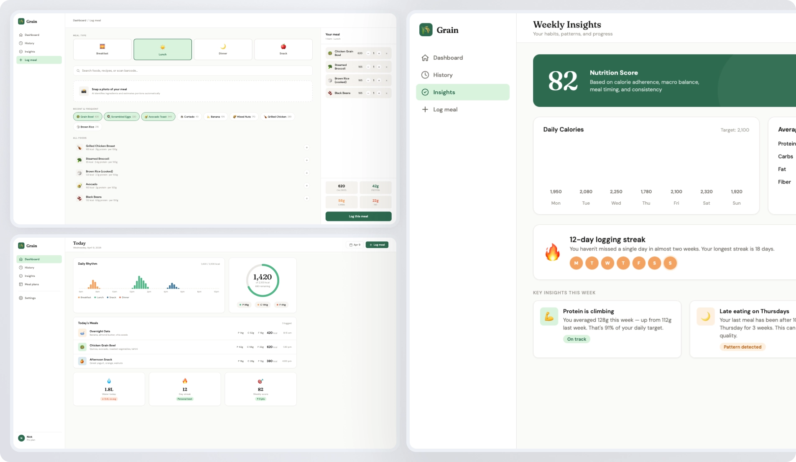
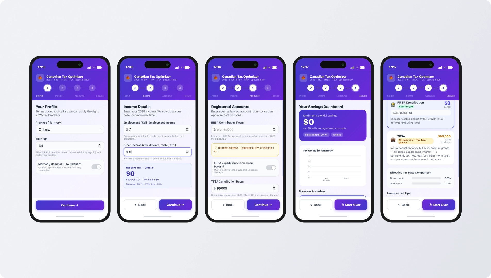
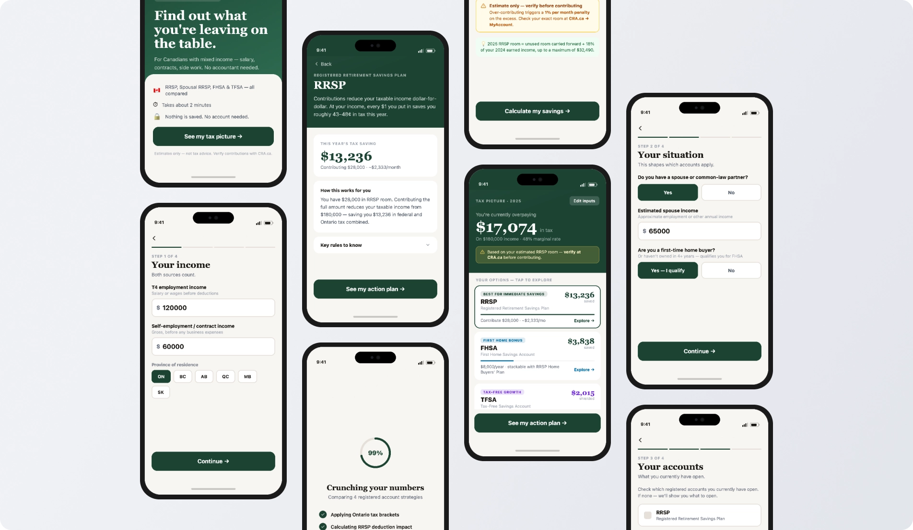

# Zypsy Product Design Skills

A behavioral instruction file that teaches AI coding agents how to design like Zypsy. It shapes how the agent reasons about UI work, not just what it produces visually, but how it structures information, handles states, writes copy, designs for AI, and builds systems.

<br>

## Background

[Zypsy](https://www.zypsy.com/) is a design studio based in SF, USA. Over a decade of shipping products for funded startups and global brands, certain principles kept proving out across every engagement. This file is an attempt to encode those principles in a form an AI agent can actually use.

<br>

## See It In Action

### Before applying the skill
The output has inconsistent spacing, mismatched icon sizes, broken interactions, and no clear hierarchy, with the default AI aesthetic like gradients, busyness, and no restraint.



### After applying the skill
The outcome is immediately more consistent, with cleaner hierarchy, working micro-interactions, and a focused layout that surfaces key insights instead of noise.



> Both outputs were generated from the same prompt in a single pass. No post-generation edits were made to either result.

---

<br>


### Before applying the skill
The output feels template-driven, polished on the surface but visually loud, with a generic finance app aesthetic and no clear sense of priority.



### After applying the skill
The result feels more intentional, cleaner hierarchy, and focused on the actual job to be done rather than looking cool. Pre-filled inputs and a subtle end animation came out of the box.



> Both outputs were generated from the same prompt in a single pass. No post-generation edits were made to either result.
---

<br>

## Installation

### Claude Code

First, add the marketplace source:

```
/plugin marketplace add zypsycom/product-design-skills
```

Then install the plugin:

```
/plugin install zypsy-product-design-skills
```

### Cursor

1. Open Cursor Settings (`Cmd+Shift+J` / `Ctrl+Shift+J`)
2. Go to `Rules & Command` → `Project Rules` → Add Rule → Remote Rule (GitHub)
3. Enter: `https://github.com/zypsycom/product-design-skills.git`

### Any agent

```bash
npx skills add zypsycom/product-design-skills
```

> Skills are extracted individually, so you'll need to upgrade them manually.


<br>

## Who it's for

**Developers building their own products** who want AI-assisted UI that doesn't default to generic patterns.
**Designers using AI coding tools** who want the agent to carry some of the design thinking, not just generate passable HTML.
**Design-aware founders and PMs** who are using Cursor or similar tools to prototype and want the output to be structurally sound, not just visually presentable.

Note: It is not intended to replace a designer on complex products. It is intended to raise the quality ceiling on AI-assisted output, and to make the gap between "AI-generated" and "designed" a bit smaller.

<br>

## Response modes

The skill uses two modes, triggered automatically based on request scope.

**Quick mode** : a component question, a critique, a fast check. The skill applies internally. The response is direct, no structured sections, no intake questions.

**Full mode** : an app concept, a multi-screen flow, a new product area. The skill runs the four-question intake first, then responds using the Section 10 structure.

<br>

## A note on expectations

This skill can meaningfully improve output quality in areas where AI coding agents tend to fall short like structural decisions, information hierarchy, state coverage, AI feature design, copy quality, and anti-pattern avoidance.

It will not turn an AI agent into a senior product designer. Context still matters. Judgment still matters. The four intake questions exist because no skill can replace understanding the actual product, the actual user, and the actual stakes.
